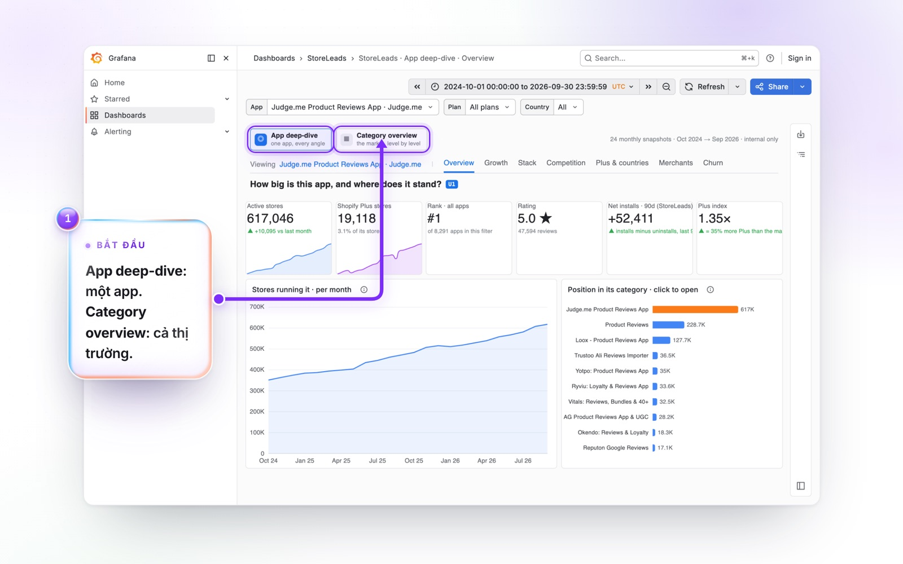
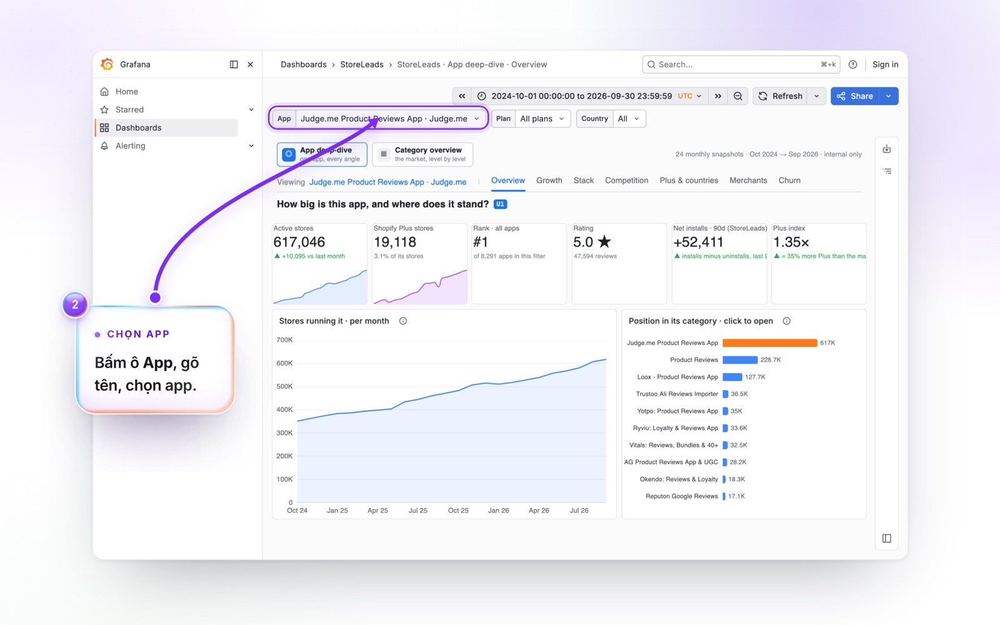
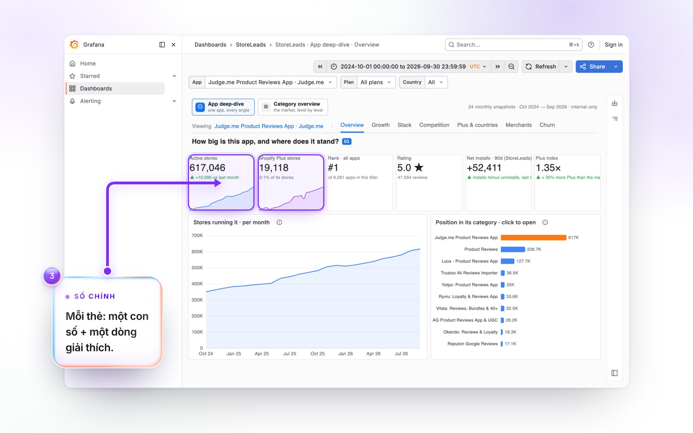
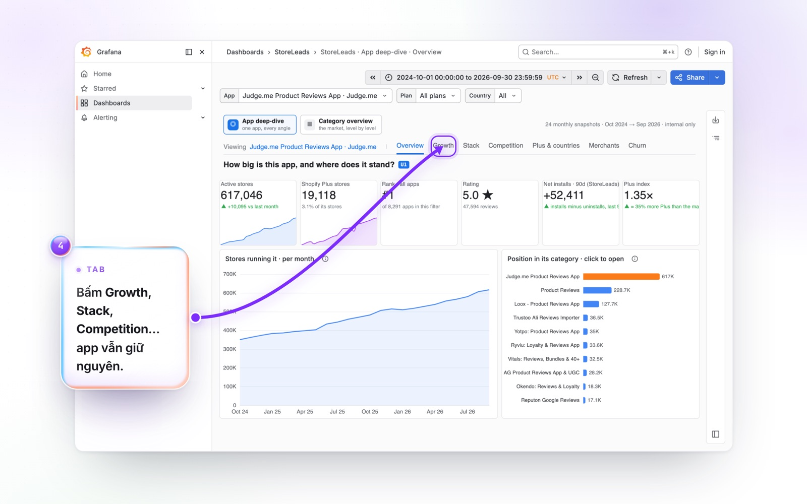
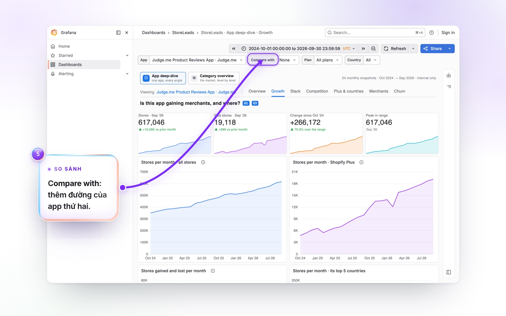
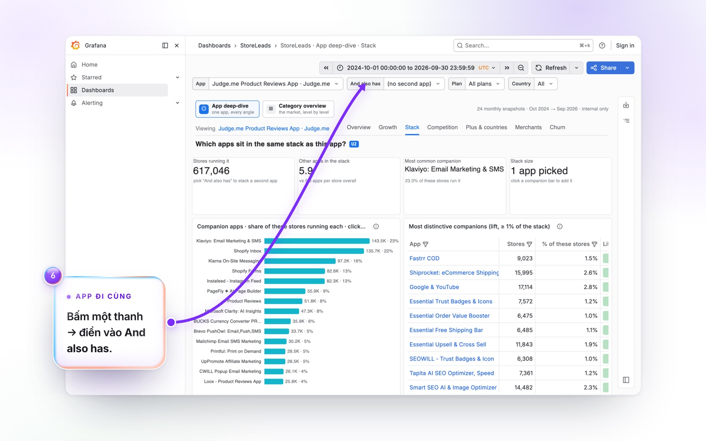
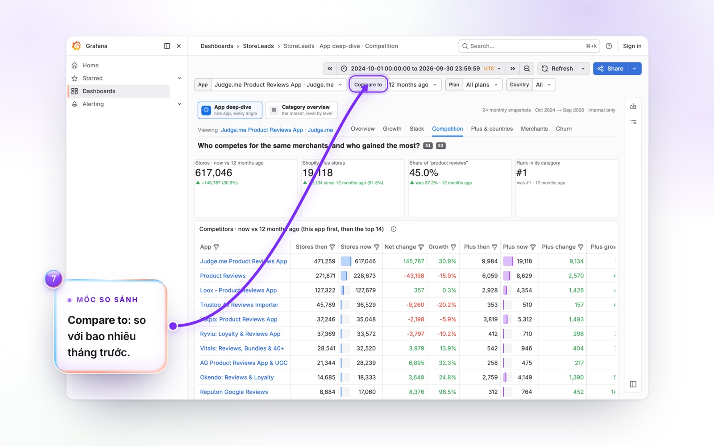
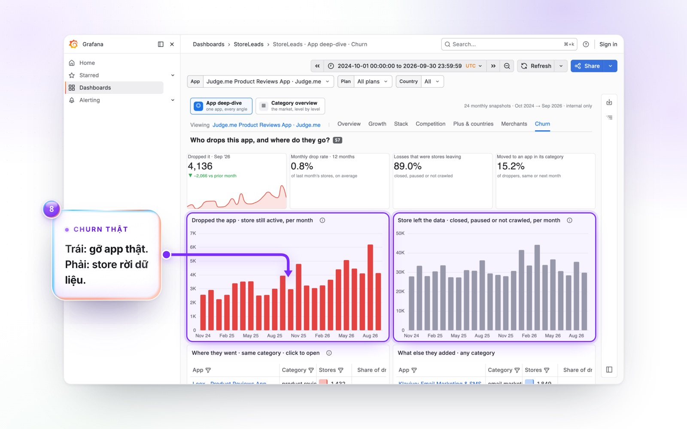
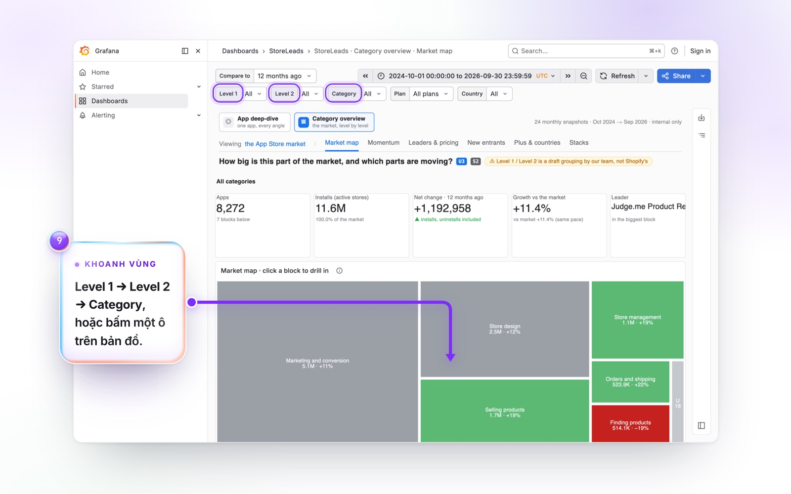

# Dùng dashboard StoreLeads trên Grafana

Trang này giúp bạn tự bấm xem số liệu StoreLeads trên Grafana, không cần Claude: 9 bước có ảnh, rồi bảng tra cứu
13 tab.

**[▶ Mở dashboard](https://storedata.ecvision.ai/d/sl-app-overview)** (đăng nhập bằng Slack)

## Grafana hay hỏi Claude?

| Bạn muốn | Dùng |
|---|---|
| Một câu trả lời cụ thể ("Judge.me tăng bao nhiêu trong 6 tháng?") | Hỏi Claude |
| Một trang tổng hợp có giải thích, brief, post-mortem | Hỏi Claude |
| Lang thang xem, bấm thử app khác, chuyển category, không biết trước mình tìm gì | Grafana |
| Xem biểu đồ theo tháng, để họp hoặc chụp màn hình nội bộ | Grafana |
| Một lát cắt lạ mà dashboard không có | Hỏi Claude |

Hai nơi dùng cùng một dữ liệu, nên số khớp nhau. Claude cũng thường gửi kèm link dashboard tương ứng, bấm vào là mở
đúng app bạn hỏi.

## Đăng nhập

Mở https://storedata.ecvision.ai/d/sl-app-overview, chọn đăng nhập bằng Slack. Chỉ xem được, không sửa được gì.
Chưa vào được: xem [Sự cố](./05-su-co.md).

## Hướng dẫn từng bước

<!-- walkthrough:start (generated by scripts/sync-walkthrough.mts from Guide Studio — do not edit) -->

### Bước 1. Hai cửa: một app, hoặc cả thị trường

Trên cùng mỗi trang có hai **cửa**. **App deep-dive** xem một app từ mọi góc. **Category overview** xem cả thị trường, từ nhóm lớn xuống từng category. Bấm để đổi cửa bất cứ lúc nào.

> [!TIP]
> Đừng chỉnh ô thời gian góc trên bên phải: dữ liệu đi theo tháng (10/2024 → 9/2026), không theo ô đó.

### Bước 2. Chọn app bạn muốn xem

Bấm ô **App** rồi gõ vài chữ tên app (ví dụ *loox*), chọn đúng app trong danh sách. Mặc định là Judge.me. Mọi tab sau đó đều đổi theo app bạn chọn.

> [!TIP]
> Tên app hay trùng nhau. Nhìn kỹ tên đầy đủ trước khi chọn.

### Bước 3. Đọc hàng thẻ số

Hàng thẻ trên cùng là câu trả lời ngắn: app có bao nhiêu store, bao nhiêu là Shopify Plus, tăng giảm thế nào. Dòng chữ nhỏ dưới mỗi số giải thích con số đó nghĩa là gì.

> [!NOTE]
> "Hiện nay" là snapshot mới nhất (9/2026), không phải hôm nay.

### Bước 4. Chuyển tab để xem góc khác

Dải tab dưới hai cửa dẫn sang các trang khác của cùng app: **Growth** (tăng trưởng), **Stack** (app hay đi cùng), **Competition** (đối thủ), **Plus & countries**, **Merchants**, **Churn**. App và bộ lọc được giữ nguyên khi chuyển tab.

### Bước 5. Growth: app đang lên hay xuống, so với một app khác

Biểu đồ theo tháng cho tất cả store và riêng Shopify Plus. Chọn một app ở ô **Compare with** để vẽ thêm đường của app đó lên cùng biểu đồ.

> [!NOTE]
> Vài tháng nhảy bất thường do cách StoreLeads thu thập (Plus 2/2025 và 2/2026, tháng 11/2025, 9/2026). Đừng đọc những tháng đó là xu hướng.

### Bước 6. Stack: merchant của app này dùng thêm gì

Biểu đồ **Companion apps** liệt kê app hay chạy cùng trên các store đó. Bấm một thanh để chọn app đó vào ô **And also has**: cả trang sẽ chỉ xét những store có cả hai app.

> [!TIP]
> "Lift" cao = cặp app này đi cùng nhau nhiều hơn mặt bằng chung. Đây không phải thứ tự cài đặt.

### Bước 7. Competition: ai đang thắng trong cùng category

Bảng đối thủ cùng category: số store bây giờ và một mốc trước đó, ai tăng, ai giảm, thị phần. Đổi mốc ở ô **Compare to** (1, 3, 6, 12 hoặc 24 tháng trước).

### Bước 8. Churn: gỡ app thật, và store rời dữ liệu

Hai biểu đồ tách hai chuyện khác nhau. **Dropped the app**: store vẫn hoạt động nhưng đã gỡ app, đây là churn thật. **Store left the data**: store đóng cửa, tạm dừng hoặc không còn được thu thập. Bên dưới có bảng app mà store chuyển sang.

### Bước 9. Category overview: khoanh vùng thị trường

Chọn **Level 1**, rồi **Level 2**, rồi **Category** để thu hẹp dần, hoặc bấm thẳng vào một ô trên bản đồ để đi sâu vào ô đó. Màu cho biết nhóm đó tăng nhanh hơn hay chậm hơn thị trường.

> [!NOTE]
> Level 1 / Level 2 là cách nhóm tạm (draft) của team, không phải của Shopify.

**Chia sẻ:** link trên thanh địa chỉ giữ nguyên app và bộ lọc, copy gửi đồng nghiệp là họ thấy đúng trang bạn đang xem (họ cũng cần đăng nhập Slack).

**Muốn hỏi sâu hơn?** Hỏi Claude với plugin StoreLeads: [hướng dẫn cài](https://github.com/pdtoan2811-bit/storeleads-plugin).

> Chỉ dùng nội bộ: không xuất danh sách store để outreach, không đăng số liệu ra ngoài.

<!-- walkthrough:end -->

## Tra cứu: 13 tab

Mỗi cửa có một dải tab ở đầu trang. Bấm tab để đổi góc nhìn, app hay category đang chọn vẫn giữ nguyên.

### Cửa 1: App deep-dive (xem một app)

| Tab | Trả lời câu hỏi gì | Điều khiển chính |
|---|---|---|
| Overview | App này lớn cỡ nào, bao nhiêu store, bao nhiêu Plus, xu hướng gần đây | App |
| Growth | Tăng hay giảm theo tháng, riêng Plus | App, **Compare with** để vẽ thêm một app |
| Stack | Store của app này còn dùng app nào (đi cùng nhau, không phải thứ tự cài) | App, **And also has** để thêm app thứ hai |
| Competition | Ai cùng category, ai đang thắng, ai đang thua | **Compare to**: so với 1, 3, 6, 12 hoặc 24 tháng trước |
| Plus & countries | Mạnh ở nước nào so với mặt bằng, khoảng trống Plus | App |
| Merchants | Merchant của app là ai: theme, store mới mở, danh sách ngắn | App |
| Churn | Gỡ app thật hay store rời dữ liệu, và store bỏ app chuyển sang đâu | App |

### Cửa 2: Category overview (xem một ngành hàng)

| Tab | Trả lời câu hỏi gì |
|---|---|
| Map | Bức tranh toàn cảnh: category nào lớn, nhóm nào tăng nhanh hơn thị trường |
| Momentum | Category nào đang lên nhanh hơn thị trường, app nào tăng nhiều nhất |
| Leaders | Ai dẫn từng category, dẫn chắc hay yếu, category nào phân mảnh |
| Entrants | App mới lên App Store và đã kéo được bao nhiêu store |
| Geo | Khoảng trống: store Plus ở từng nước chưa có app nào trong category |
| Stacks | Các app trong category hay đi cùng app nào |

Phần lớn tab ở cửa này dùng được cho câu hỏi "có nên làm app trong category này không".

## Thao tác nhanh

- **Đổi app:** ô **App** trên đầu trang, hoặc bấm một thanh trong biểu đồ để nhảy sang app đó.
- **So sánh hai app:** **Compare with** ở tab Growth (hai đường trên cùng biểu đồ). **And also has** ở tab Stack là
  việc khác: chỉ xét store có cả hai app.
- **Mốc thời gian:** dùng **Compare to**. Đừng chỉnh ô thời gian góc trên bên phải: dữ liệu đi theo tháng
  (10/2024 → 9/2026), không theo ô đó.
- **Khoanh vùng category:** **Level 1 → Level 2 → Category**, hoặc bấm thẳng một ô trên bản đồ. Level 1 / Level 2 là
  nhóm tạm (draft) của team, xem [Đọc số cho đúng](./03-doc-so-cho-dung.md).
- **Chia sẻ:** link trên thanh địa chỉ giữ nguyên app và bộ lọc. Gửi trong Slack nội bộ, người nhận (đã đăng nhập)
  thấy đúng màn hình của bạn.

## Lưu ý

- Mỗi biểu đồ có thể mất vài giây mới hiện. Đợi hết vòng xoay trước khi đổi tiếp.
- Tab nào hiện ô lỗi đỏ: chụp màn hình gửi Toàn.
- Chụp màn hình để họp nội bộ được, nhưng không đăng ra ngoài. Xem mục cuối [Đọc số cho đúng](./03-doc-so-cho-dung.md).

Tiếp theo: [Sự cố & câu hỏi thường gặp](./05-su-co.md) · [Cách hỏi Claude](./01-cach-hoi.md)
